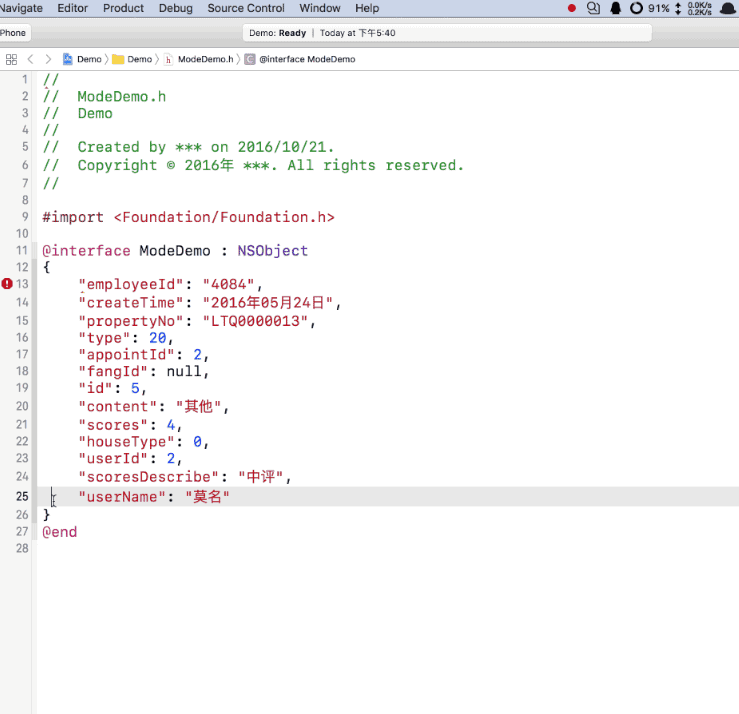

# Introduction
Json to Property (Xcode8 Editor Extension)
 
快速把jsonString格式为属性
 
 

#Download
<a href ="https://github.com/keepyounger/Json2Property/blob/master/Json2Property.zip?raw=true"> Json2Property </a>  

# Support
Xcode 8 or later
# Thanks
<a href ="https://github.com/EnjoySR/ESJsonFormat-Xcode"> ESJsonFormat-Xcode </a>  
